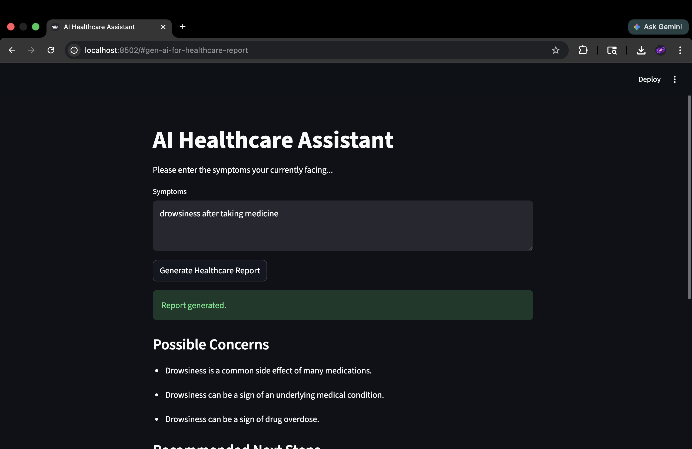
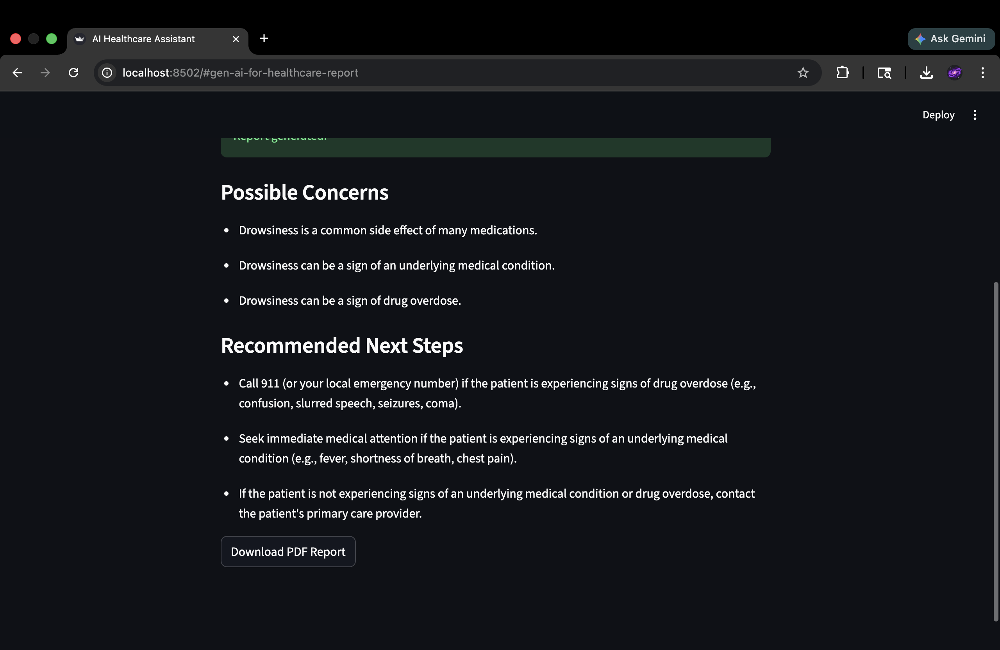

# AI Healthcare Assistant

Fine-tuned medical LLM for symptom analysis and personalized healthcare report generation.

## Overview

The AI healthcare assistant accepts user symptoms as input and generate:

  * Possible health concerns
  * Recommended next steps
  * Generates downloadable PDF healthcare report


---

## Features

* Fine-tuned LLM(Gemma 2B model) using QLoRA (PEFT)
* Medical instruction tuning using MedQuAD
* Symptom analysis and recommendations
* PDF report generation
* Streamlit web application
* Base vs fine-tuned evaluation pipeline

---

## Tools

* Python
* Hugging Face Transformers
* Gemma 2B Instruct
* PEFT / QLoRA
* MedQuAD Dataset
* Streamlit
* ReportLab

---

## Project Structure

```text id="cyx6t4"
AI-Healthcare-Assistant/
│
├── app.py                      # Streamlit application
│
├── src/
│   ├── main.py                 # Base model inference pipeline
│   ├── main_finetuned.py       # Fine-tuned model inference pipeline
│   │
│   ├── models/
│   │   ├── inference.py
│   │   └── inference_finetuned.py
│   │
│   ├── prompts/
│   │   └── triage_prompt.py
│   │
│   └── outputs/
│       ├── parser.py
│       └── report_generator.py
│
├── training/
│   ├── finetune.py             # QLoRA fine-tuning
│   ├── prepare_dataset.py
│   └── train.json
│
├── data/
│   └── prepare_medquad.py      # MedQuAD preprocessing
│
├── evaluation/
│   ├── evaluate.py             # Base vs fine-tuned evaluation
│   ├── test_prompts.py
│   ├── results.csv
│   └── terminal_log.txt
│
├── requirements.txt
└── README.md
```

---

## Fine-Tuning

* Base Model: Google Gemma 2B Instruct
* Dataset: 500-sample subset of MedQuAD
* Fine-tuning: QLoRA
* Epochs: 3

Training loss:

```text id="m0te7j"
Epoch 1: 13.02
Epoch 2: 12.86
Epoch 3: 12.83
```

---

## Evaluation

Compared:

* Base Gemma
* Fine-tuned Gemma

Findings:

* Fine-tuned model improved domain-specific reasoning in high-risk cases
* Base model showed stronger formatting consistency

Evaluation outputs stored in:

```text id="rxl6up"
evaluation/results.csv
evaluation/terminal_log.txt
```

---

## UI
* 
* 

---

## Run

Install:

```bash id="yz42ru"
pip install -r requirements.txt
```

Launch app:

```bash id="xah8e1"
streamlit run app.py
```

Run evaluation:

```bash id="8jlwmx"
python -m evaluation.evaluate
```

---


